= Benutzer Handbuch
:toc: macro 

== Inhaltsverzeichnis
toc::[]

== Einführung

Dies ist das Benutzerhandbuch für die Anwendung "PizzaShop" , welche für die Firma "PapaPizza" erstellt wurde.
Sie dient zur Erleichterung der Arbeit in der Filiale für die Verkäufer,Bäker, Lieferanten und dem Admin.
Desweiteren kann sie zur Präsentation der Firma im Internet genutzt werden, wodurch Kunden z.B. das Angebot durchstöbern können.
Hier ist eine Anleitung zur Verwendung der einzelnen Bereiche der Anwendung zu finden.

== Allgemeine Navigation

image::Bilder/allgemeineNavigation.png[]

Die obere Navigationsleiste (aus der Sicht des Admins).
Die Mitarbeiter haben ihre benötigten Menüs im DropDownMenü "Menü", welches für den Kunden nicht sichtbar ist.

== Einloggen

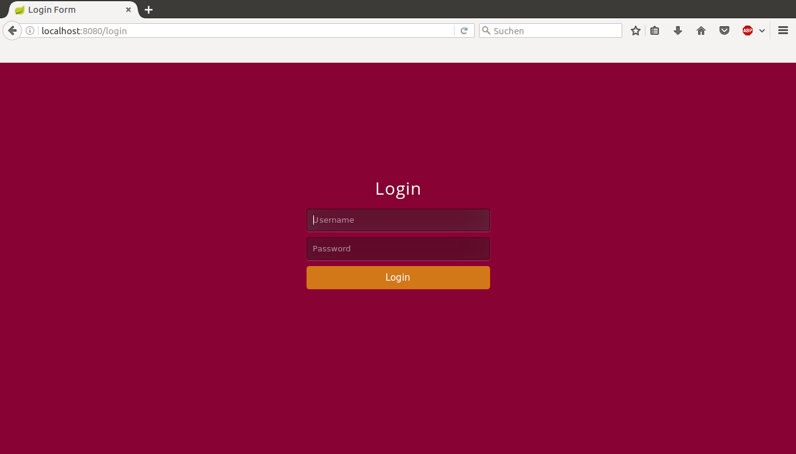

Die Login-Seite

== Warenkatalog

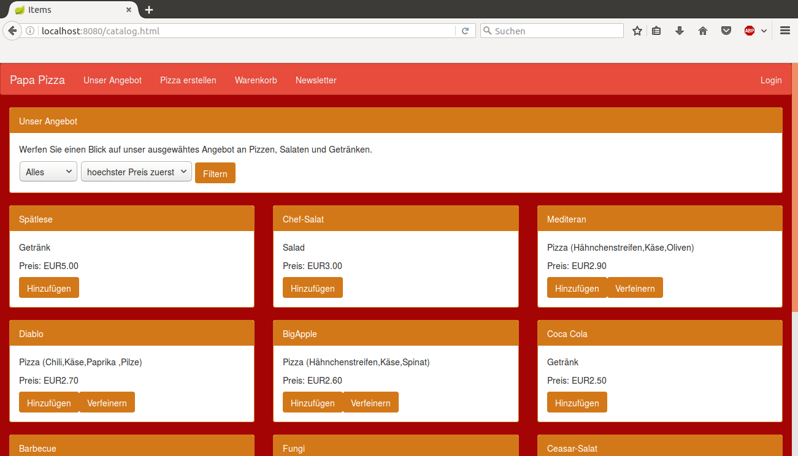

Der Warenkatalog aus Sicht eines Kunden. Man kann den Katalog sortieren, Waren dem Warenkorb hinzufügen und eine Pizza nach den eigenen Wünschen verfeinern mithilfe der jeweiligen Buttons.

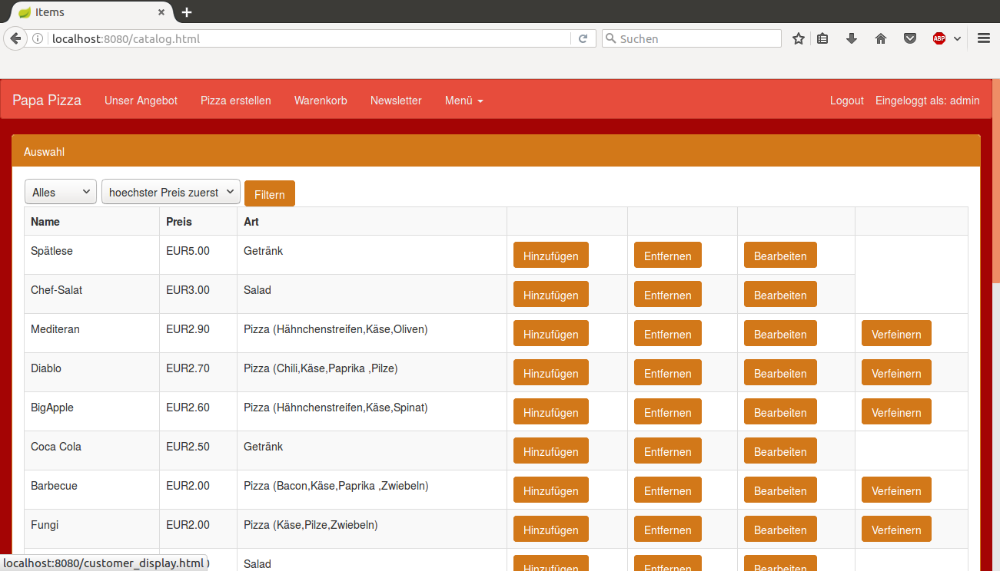

Der Warenkatalog aus Sicht des Admins. Er kann Items aus dem Warenkatalog entfernen, sie bearbeiten und Pizzen dauerhaft verfeinern.

image::Bilder/catalogSeller.png[]

Der Warenkatalog aus Sicht des Verkäufers. Er kann Items dem Warenkorb hinzufügen und Pizzen temporär verfeinern. 

=== Item bearbeiten/hinzufügen

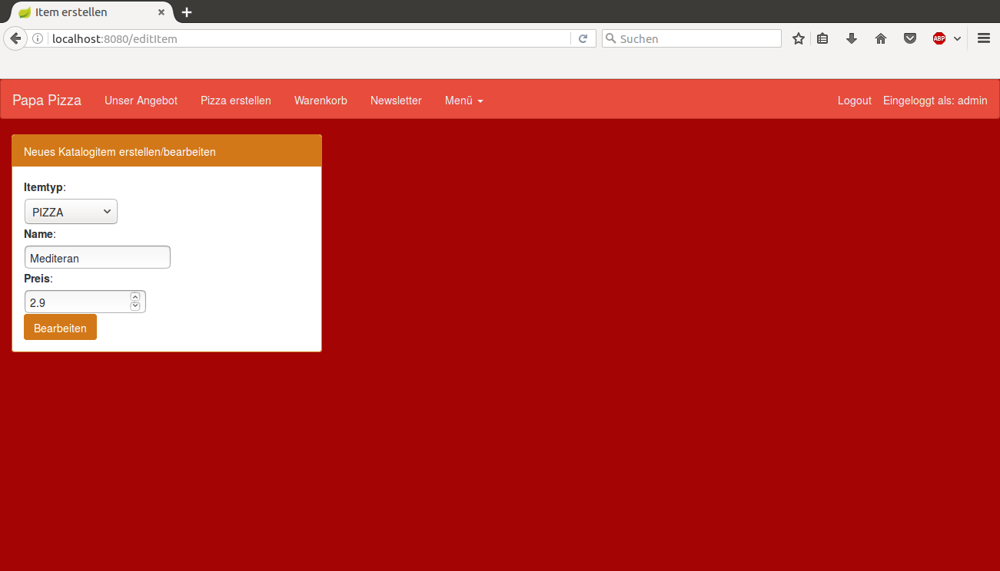

Der Admin und der Verkäufen können Items bearbeiten. Der Unterschied besteht darin, dass ein Verkäufer ein neues Item im Warenkatalog hinzufügt und der Admin ein bestehendes Item überschreibt.

=== Waren hinzufügen

=== Pizza erstellen/verfeinern

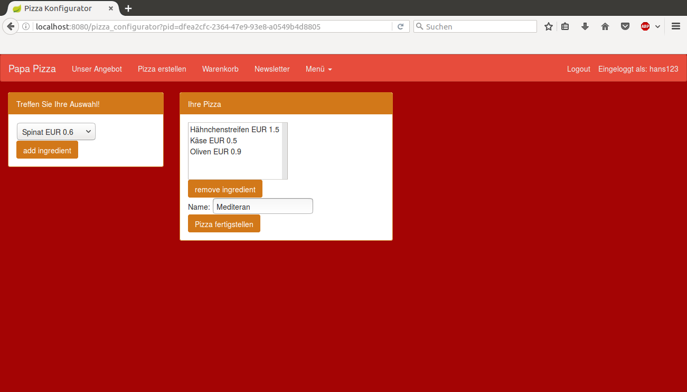

Hier können Kunden ihre eigenen Pizzen aus einer Auswahl an Zutaten erstellen. Der Admin kann hier komplett neue Pizzen dem Warenkatalog hinzufügen und der Verkäufer übernimmt die Angaben des Kunden um die vom Kunden gewünschte, persönliche Pizza zu erstellen und in den Warenkorb zu legen.

== Warenkorb

== Finanzen

image::Bilder/finanzen.png[]

Die Finanzübersicht des Admins. Er kann hier durch die Kalenderwochen gehen und die Einträge überprüfen.
In einem extra Panel besteht die Möglichkeit, die Buisinesstime vorzuspulen.

== Bestellungen

=== Bestellungübersicht

image::Bilder/ordersAdmin.png[]

Hier sieht der Admin die laufenden und abgeschlossenen Bestellungen des Pizzashops. 

image::Bilder/ordersSeller.png[]

Der Seller kann auf seiner Übersicht der Bestellungen nur die aktiven Bestellungen sehen. Den Bestellungen kann der Lieferant zugewiesen werden. Falls ein falscher Lieferant zugewiesen wurde, kann dies noch geändert werden.

=== Bestellung zuweisen

== TAN-System

image::Bilder/tans.png[]

Auf der Seite für die TAN-Liste sieht der Admin, welche TANs gerade im Umlauf sind, welche noch nicht vom System bestätigt sind und welche eingelöst worden sind.

== Newsletter

=== Email hinzufügen/entfernen

=== Newsletter 

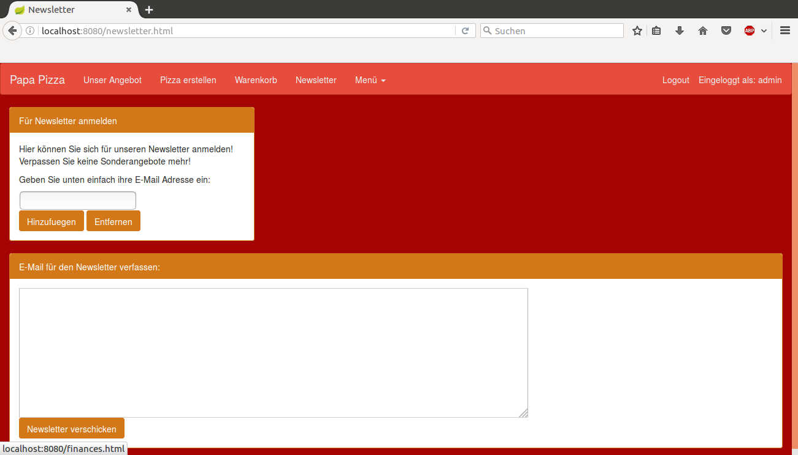

Auf dieser Seite kann der Admin den Text für die Newsletter-Email schreiben und diese E-Mail dann verschicken.

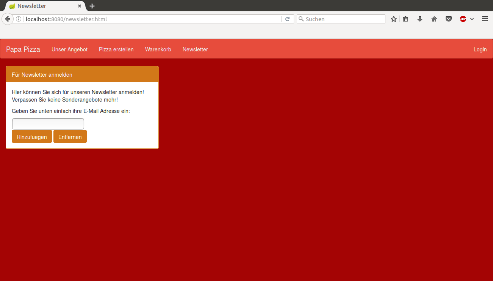

Der Kunde kann sich hier in die E-Mail-Liste für den Newsletter eintragen.
== Öfen

image::Bilder/ovensAdmin.png[]

Der Admin hat hier die Möglichkeit einen neuen Ofen dem Shop hinzuzufügen, dabei wird ein neuer Finanzeintrag erstellt. Außerdem kann er hier defekte Öfen löschen.

image::Bilder/ovensBaker.png[]

Der Bäcker kann auf seiner einzig relevanten Seite die nächste Pizza die in der Warteschlange ist in einen Ofen legen.

== Personenverwaltung

=== Mitarbeiter 

==== Admin

==== Verkäufer

==== Bäcker

==== Lieferant

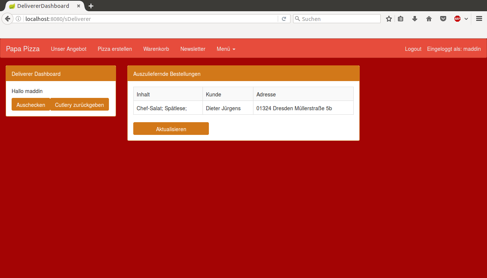

Die Startseite des Lieferanten. Er kann sich hier einchecken, die Essgarnitur eines Kunden zurückgeben und seine Liste der Kunden die er beliefern soll aktualisieren.

==== Mitarbeiterübersicht

image::Bilder/mitarbeiterAnzeigen.png[]

Die Mitarbeiterübersicht für den Admin. Er kann hier Mitarbeiter überarbeiten oder entfernen.

==== Mitarbeiter bearbeiten

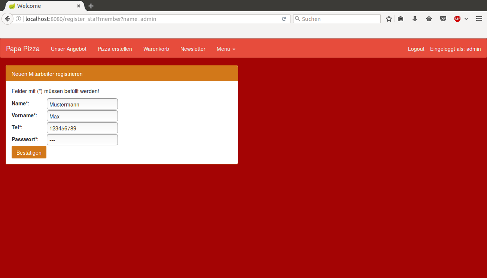

Auf dieser Seite kann der Admin die Daten eines Mitarbeiters überarbeiten.

==== Mitarbeiter entfernen

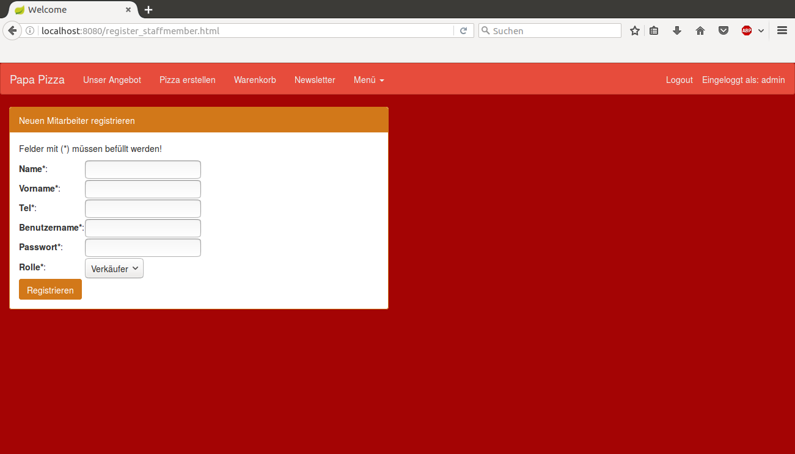

Der Admin kann hier einen neuen Mitarbeiter registrieren und seine Rolle festlegen (es kann allerdings immer nur einen Admin geben).

=== Kunden

==== Kundenübersicht

image::Bilder/delivererCutlery.png[]

Der Lieferant kann hier auswählen (nachdem er auf seiner Startseite auf "Cutlery zurückgeben" geklickt hat) welcher Kunde seine Cutlery zurückgegeben hat.

image::Bilder/kundenAnzeige.png[]

Der Admin kann hier Kunden bearbeiten oder entfernen. 

==== Kunden registrieren

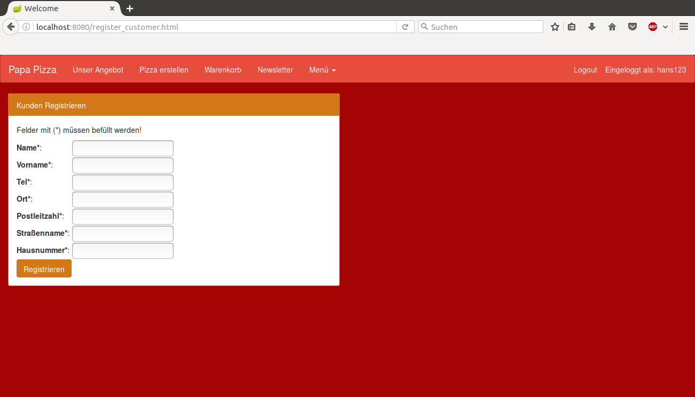

Der Verkäufer kann auf dieser Seite neue Kunden registrieren.

==== Kunden bearbeiten

image::Bilder/kundenBearbeiten.png[]

Der Admin kann hier Kundendaten überarbeiten.

==== Kunden entfernen
